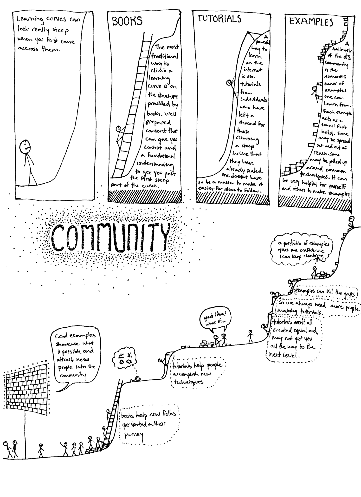

# Leveling up your Visualization and Storytelling Skills

Welcome to the repo of the workshop „Leveling up your Visualization and Storytelling Skills“.

In order to sell your great, groundbreaking ideas as a data scientist in order to get the buy-in of decision makers, one must learn to _communicate_ ideas (and hopefully results!). However, many data scientists do have a strong academic background and focus on their _hard skills_ such as building and evaluation machine learning models, optimization, statistics, coding, ...

I do think that most of you will having the largest ROI in spending some time in improving the soft areas (_in fact I suffered through many poor presentations and unfortunately ugly visualizations_). Therefore the goal here is to teach you basic methods and knowledge in both the visualization department as well as storytelling.

You are also guided to additional resources for further study, but note that at the end of the day you must apply the skills.

Probably the likes of Confucius or Albert Einstein would say the road to mastery is long. This is supposed to part of it: produced by the community for the community.

Maybe you end up gaining new insights, why not share them by presenting on a [PyData conference](https://www.pydata.com)?

__Word of warning__: There is a large design component in visualisation and it can be considered an art – just like storytelling – thus, very probably, you may disagree on aesthetics and taste. It is okay and expected. More importantly, you will at least get technical knowledge out of this talk and some insights on what makes a good presentation.

# Sources

1. The Python Visualization Landscape. Jake VanderPlas. PyCon 2017. [[video]](https://www.youtube.com/watch?v=FytuB8nFHPQ **(A good overview about the visualization libraries of Python in 2017.)**

2. 
